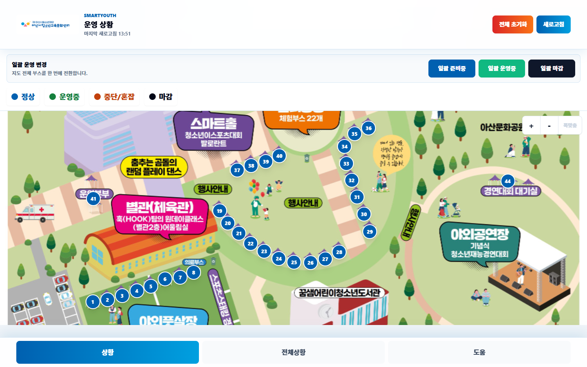
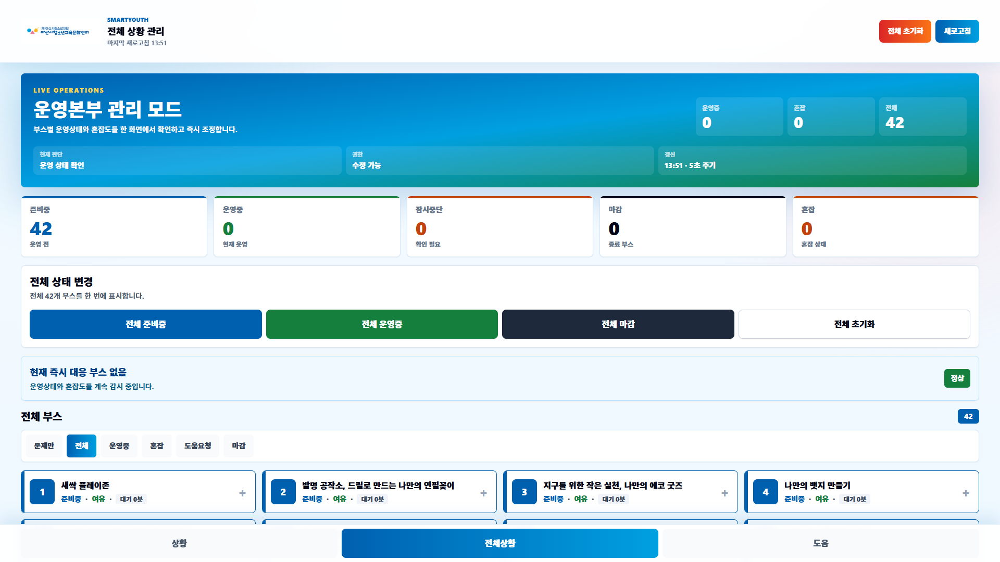
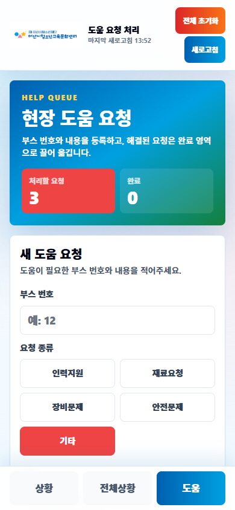

# SmartYouth 운영 상황판

<p align="center">
  
</p>

아산시청소년재단 아산시청소년교육문화센터 행사 현장에서 부스 운영 상태, 혼잡도, 도움 요청을 빠르게 판단하고 조정하기 위한 운영본부용 웹 상황판입니다.

공개 데모: https://minun001.github.io/smartyouth

## 화면 미리보기

### 운영 상황

운영본부가 현장 배치도 위의 부스 번호를 눌러 상태를 확인하고, 준비중/운영중/마감 상태를 일괄 변경할 수 있는 지도 중심 화면입니다.



### 전체 상황 관리

넓은 모니터에서는 카드가 3-4열로 확장되어 한 화면에서 더 많은 부스를 볼 수 있습니다. 운영 상태, 혼잡도, 도움 요청 여부를 빠르게 훑어보는 화면입니다.



### 도움 요청 처리

모바일에서도 부스 담당자가 도움 요청을 등록하고, 운영본부는 요청 카드를 처리/완료 흐름으로 관리할 수 있습니다.



## 목적

SmartYouth는 행사 당일 운영본부가 종이 체크리스트나 단체 메신저만으로 놓치기 쉬운 상태 변화를 한 화면에서 관리하도록 만든 도구입니다.

- 부스별 운영 상태를 준비중, 운영중, 잠시중단, 마감으로 관리
- 혼잡도를 여유/혼잡 기준으로 빠르게 전환
- 현장 지도 위 부스 번호를 눌러 즉시 상태 확인
- 도움 요청을 등록하고 처리 완료까지 추적
- HQ 링크와 부스별 QR 링크로 별도 계정 로그인 없이 접근
- 모바일, 태블릿, 운영본부 모니터 가로폭에 맞춰 적극적으로 반응

## 주요 화면

| 화면 | 경로 | 용도 |
| --- | --- | --- |
| 운영 상황 | `/hq?t=demo-hq` | 지도 기반 부스 선택, 일괄 운영 변경, 개별 상태 조정 |
| 전체 상황 | `/overview?t=demo-hq` | 전체 부스 카드, 필터, 최근 변경 기록 확인 |
| 도움 | `/help?t=demo-hq` | 도움 요청 등록, 처리 시작, 완료 처리 |
| 부스 QR | `/booth/1?t=demo-booth-1` | 개별 부스 담당자용 상태 변경 화면 |

## 디자인 방향

현재 UI는 실제 행사 운영본부에서 빠르게 판단할 수 있도록 설계되어 있습니다.

- 아산시청소년교육문화센터 로고 색상 기반의 파랑, 하늘, 초록 조합
- 상단 고정 배너와 하단 탭 내비게이션
- 지도 기반 핀 선택과 확대/축소 조작
- 운영 상태와 혼잡 상태의 색상 체계 통일
- 좁은 화면에서는 수정 패널을 단독 화면처럼 보여주고, 넓은 화면에서는 지도와 패널을 나란히 표시
- 1536px 이상 모니터에서는 전체 상황 카드가 더 많은 열로 확장

## 데이터 운영 방식

GitHub Pages는 정적 호스팅이므로 서버 API를 직접 실행할 수 없습니다. 실제 행사에서 여러 휴대폰과 운영본부 화면이 같은 데이터를 보려면 Cloudflare Workers + D1 + WebSocket 백엔드를 함께 사용합니다.

- GitHub Pages: 화면 배포
- Cloudflare Worker: API, 상태 저장, 실시간 변경 신호
- Cloudflare D1: 부스 상태, 도움 요청, 변경 기록 저장
- WebSocket: 상태 변경 신호 전파
- fallback: WebSocket이 안 될 때 주기적으로 다시 불러오기

데모 모드는 각 브라우저의 로컬 저장소를 사용합니다. 미리보기에는 좋지만, 실운영 공유 데이터로는 사용하지 마세요.

## 로컬 실행

```bash
npm install
npm run dev
```

브라우저에서 엽니다.

```text
http://localhost:3000
```

정적 GitHub Pages 빌드를 로컬에서 재현하려면 다음을 실행합니다.

```bash
npm run typecheck
npm test
npm run build:pages
```

## 환경 변수

`.env.example`을 `.env.local`로 복사한 뒤 필요한 값을 설정합니다.

```bash
NEXT_PUBLIC_SITE_URL=http://localhost:3000
NEXT_PUBLIC_API_BASE_URL=
NEXT_PUBLIC_REALTIME_URL=
SUPABASE_URL=...
SUPABASE_SERVICE_ROLE_KEY=...
HQ_TOKEN=...
BOOTH_TOKEN_SECRET=...
```

`SUPABASE_SERVICE_ROLE_KEY`는 서버 라우트에서만 사용해야 하며 브라우저 코드에 노출하면 안 됩니다.

## Cloudflare 실운영 백엔드

GitHub Pages 배포본을 실제 공유 데이터 버전으로 운영하려면 먼저 Cloudflare Worker와 D1을 준비합니다.

1. Cloudflare 로그인

```bash
npx wrangler login
```

2. D1 데이터베이스 생성

```bash
npm run worker:d1:create
```

3. 출력된 database id를 `wrangler.toml`에 입력

```toml
database_id = "..."
```

4. Worker 비밀값 등록

```bash
npx wrangler secret put HQ_TOKEN
npx wrangler secret put BOOTH_TOKEN_SECRET
```

5. 스키마와 부스 데이터 적용

```bash
npm run worker:d1:apply
```

6. Worker 배포

```bash
npm run worker:deploy
```

7. GitHub repository secrets 설정

```text
NEXT_PUBLIC_API_BASE_URL=https://smartyouth-api.<your-subdomain>.workers.dev
NEXT_PUBLIC_REALTIME_URL=wss://smartyouth-api.<your-subdomain>.workers.dev/ws
```

위 값이 설정되면 GitHub Pages workflow는 데모 모드가 아니라 Cloudflare 백엔드와 연결된 실운영 버전으로 빌드합니다.

## 부스 QR 링크 생성

```bash
npm run generate:booth-links
```

출력된 `/booth/[boothNo]?t=...` 링크를 QR 코드로 만들어 각 부스에 배포합니다.

운영본부용 링크 예시:

```text
/hq?t=HQ_TOKEN
/overview?t=HQ_TOKEN
/help?t=HQ_TOKEN
```

데모 링크 예시:

```text
/hq?t=demo-hq
/booth/1?t=demo-booth-1
```

## 행사 당일 체크리스트

1. Cloudflare Worker와 D1 배포 상태 확인
2. `HQ_TOKEN`, `BOOTH_TOKEN_SECRET` 값 확정
3. 부스별 QR 링크 생성 및 인쇄
4. 운영본부 모니터에서 `/hq?t=HQ_TOKEN`, `/overview?t=HQ_TOKEN`, `/help?t=HQ_TOKEN` 열기
5. 부스 담당자는 QR 화면에서 운영 상태와 혼잡도 변경
6. 도움 요청은 `/help` 화면에서 접수 후 완료 처리
7. 공개 확인용 화면은 `/` 또는 `/map` 사용

## 지도 이미지

행사 배치도 이미지는 다음 경로에 둡니다.

```text
public/booth-map.png
```

지도 핀은 부스 좌표 데이터와 연결되어 표시됩니다. 이미지가 없으면 지도 화면은 명확한 placeholder를 보여줍니다.

## 기술 스택

- Next.js 15
- React 19
- Tailwind CSS
- Vitest
- Cloudflare Workers
- Cloudflare D1
- GitHub Pages

